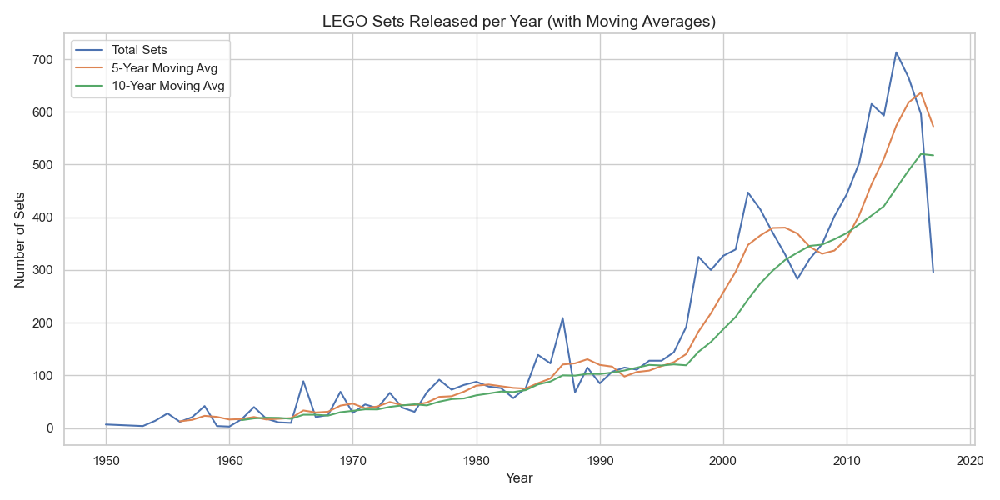
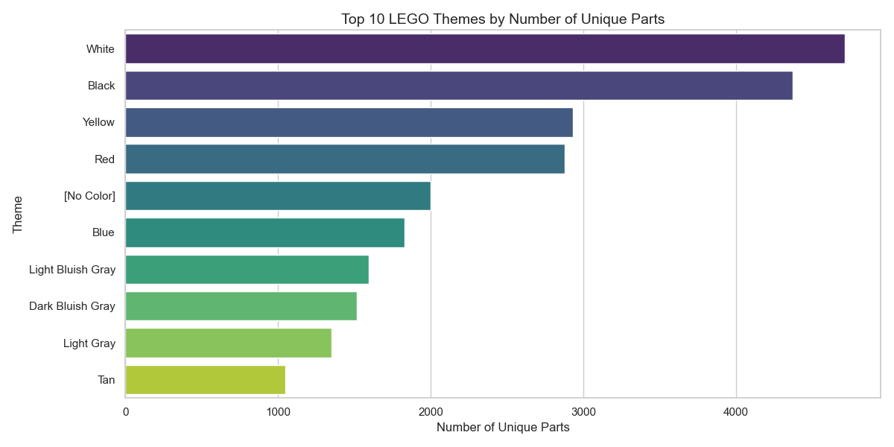
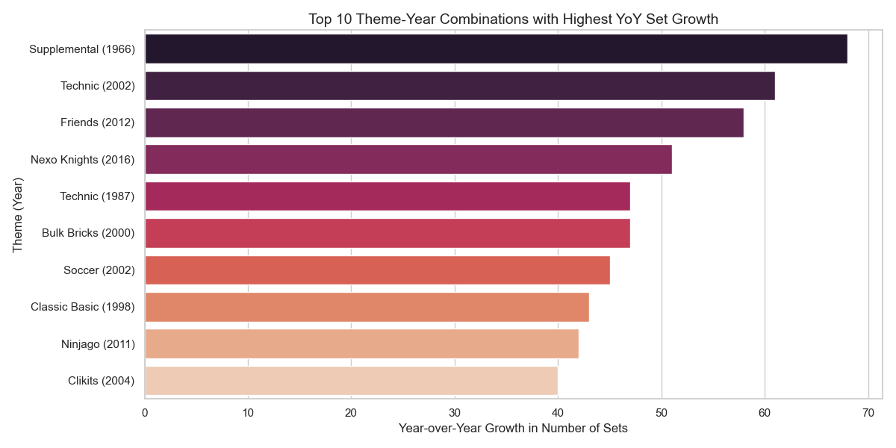
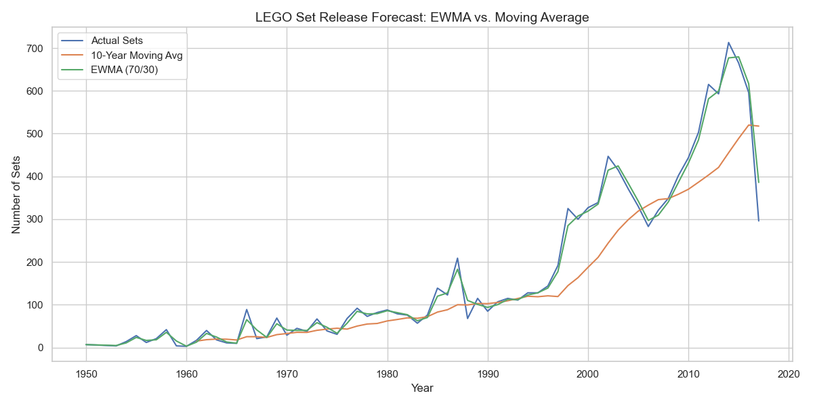

# 🧱 LEGO Data Analysis using SQL & PostgreSQL

This project explores LEGO's dataset using **advanced SQL queries**, including **data cleaning, database optimization**, and **exploratory data analysis (EDA)** in **PostgreSQL**, complemented by **Python visualizations** using `matplotlib` and `seaborn`.

---

## 🎯 Objective

Demonstrate **Data Engineering** and **Data Analysis** skills using **PostgreSQL + Python** by structuring, optimizing, querying, and visualizing a relational LEGO dataset.

---

## 📌 Project Stages

### 1️⃣ **Database Structure & Relationships**
- Modeled the relational database based on the [Rebrickable LEGO Database](https://rebrickable.com/downloads/).
- Established **primary and foreign keys** to define relationships between sets, parts, colors, and themes.

### 2️⃣ **Key SQL Queries**
- 📂 **List all tables** and define their relationships.
- 🔑 **Identify foreign key constraints** and normalization rules.
- 🔄 **Count records** per table to understand distribution and density.
- 📈 **Analyze historical trends** in set releases, parts, and themes.

### 3️⃣ **Exploratory Data Analysis (EDA)**
> Analysis done using **PostgreSQL**, then visualized with **Python**.

#### 📊 Chart 1: LEGO Sets Released per Year + Moving Averages

Displays total number of LEGO sets released annually, with a 5-year and 10-year rolling average for trend detection.



---

#### 🔧 Chart 2: Top 10 LEGO Themes by Number of Unique Parts

Shows the most complex and diverse LEGO themes based on the number of unique parts used.



---

#### 📈 Chart 3: Top 10 Theme-Year Combinations with Highest YoY Growth

Highlights explosive growth in specific themes during certain years.



---

#### 🔮 Chart 4: Forecast of LEGO Set Releases (EWMA vs. Moving Average)

Compares forecasted set volume using a 10-year Moving Average and Exponential Weighted Moving Average (EWMA 70/30).



---

## 🏗️ Database Schema

This diagram represents the full PostgreSQL schema designed for querying and relationships.


---

## 📎 Project Structure

```
lego-data-analysis/
├── data/              # Original CSV dataset
├── sql/               # SQL scripts for queries & maintenance
├── diagrams/          # Database schema models
├── scripts/           # Python scripts for visualization & automation
├── results/           # Query results in CSV format
├── visuals/           # PNG charts generated with matplotlib/seaborn
└── README.md          # This file
```

---

## 🧰 Technologies Used
- **PostgreSQL** 🐘 – Relational database engine
- **SQL** 📘 – Data cleaning, transformation, and EDA
- **Python** 🐍 – Visualization and automation
- **Matplotlib & Seaborn** 📊 – For charts
- **DB Diagram** 🧱 – For schema modeling

---

## 🚀 What's Next?
✅ Visual storytelling for analysis  
✅ CSV exports of query insights  
✅ Expand to interactive dashboards with Power BI or Streamlit  
☑️ Automate workflow with `SQLAlchemy` + `pandas`  

---

## 📫 Contact

📧 celton.aret@gmail.com  
📞 +56 9 3438 0596  
🔗 [LinkedIn](https://www.linkedin.com/in/cristobalelton/)  
🐙 [GitHub](https://github.com/Zuus89)

---

### 🌟 Want to Contribute?

Feel free to open a **pull request** or **contact me directly**. All suggestions are welcome to improve this analytical project!
