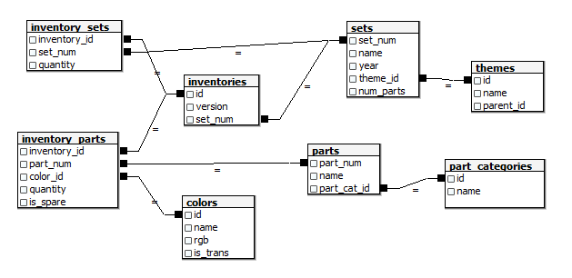

# 🧱 LEGO Data Analysis using SQL & PostgreSQL

This project explores LEGO's dataset using **advanced SQL queries**, including **data cleaning, database optimization, and exploratory data analysis (EDA)** in **PostgreSQL**. It uncovers trends in LEGO sets, parts, and themes over the years.

---

## 🎯 Objective

Demonstrate **Data Engineering** and **Data Analysis** skills using **PostgreSQL** by structuring, optimizing, and querying a relational database.

---

## 📌 Project Stages

### 1️⃣ **Database Structure & Relationships**
- **Modeled relational database** based on [Rebrickable LEGO Database](https://rebrickable.com/downloads/).
- Established **primary and foreign keys** to define relationships between sets, parts, and colors.

### 2️⃣ **Key SQL Queries**
- 📂 **List all tables** and their relationships.
- 🔑 **Identify foreign keys** and dependencies between entities.
- 🔄 **Count records** per table to understand dataset size.

### 3️⃣ **Exploratory Data Analysis (EDA)**
- 🔍 **How many LEGO sets exist per year?**
- 🎨 **What are the most commonly used LEGO colors?**
- 📊 **What are the most popular LEGO themes?**
- 🔢 **How has the number of pieces per set evolved over time?**

---

## 🏗️ **Database Schema**

The following diagram represents the database structure in PostgreSQL:



---

## 📎 **Project Structure**

```
lego-data-analysis/
├── data/ # Original CSV dataset
├── sql/ # SQL scripts for queries & maintenance
├── diagrams/ # Database schema models
├── results/ # Query results in CSV format
└── README.md # This file
```

---

## 🧰 **Technologies Used**
- **PostgreSQL** 🐘 – Relational database system.
- **SQL** 🛠️ – Advanced queries, optimization, and data cleaning.
- **DB Diagram** 🏗️ – Database modeling.

---

## 🚀 **Next Steps**
✅ **Optimize performance with indexing**  
✅ **Explore visualization with Metabase or Grafana**  
✅ **Automate queries using Python & SQLAlchemy**  

---

## 📫 **Contact**
📧 celton.aret@gmail.com  
📞 +56 9 3438 0596  
🔗 [LinkedIn](https://www.linkedin.com/in/cristobalelton/)  
🐙 [GitHub](https://github.com/Zuus89)

---

### 🌟 **How to Contribute?**
If you're interested in improving this project, feel free to **open a pull request or reach out**!  
All feedback and suggestions are welcome. 🚀
